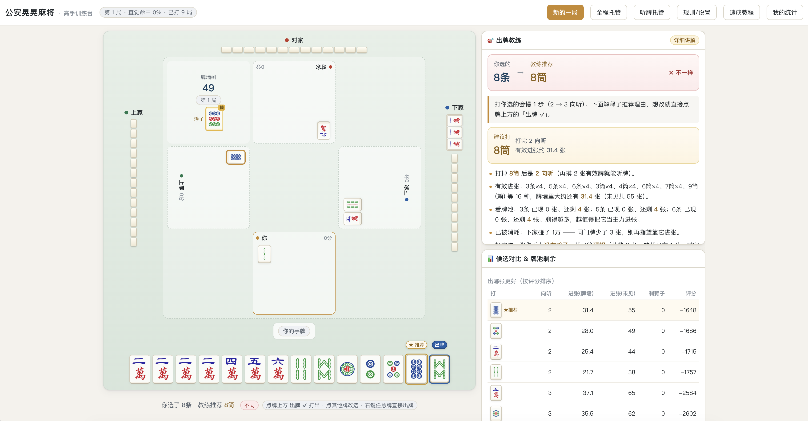

# 公安晃晃麻将 · 高手训练台

湖北公安地方玩法「晃晃麻将」的单机训练网页。你与 3 个电脑人同桌对局，内置「出牌教练」实时讲解每一手该打哪张、为什么，帮你把**向听数判断**和**有效进张计算**练成直觉，纯AI实现, 祝我早日轻轻松松上牌桌。

纯单文件实现：一个 HTML 内嵌全部 HTML / CSS / JavaScript / 牌面图片 / 合成音效，**无任何第三方依赖、无需安装、无需联网、无需构建**，双击即可在浏览器中游玩。




## 快速开始

直接用浏览器打开即可：

```
public/公安晃晃麻将-训练台.html
```

- 推荐桌面端 Chrome / Edge / Safari，页面最小宽度 1080px（窄屏可横向滚动）。
- 所有对局与统计数据只保存在本机浏览器（localStorage，键名 `huanghuang_stat_v1`），不上传任何服务器。

进入后建议先点顶部的 **「速成教程」** 看 3 分钟规则与训练方法，再点 **「新的一局」** 开始。

## 游戏规则（公安晃晃 · 常用版）

| 项目 | 规则 |
| --- | --- |
| 用牌 | 万、条、筒各 1–9，每牌 4 张，共 **108 张**（无风牌、箭牌、花牌） |
| 人数 | 4 人：你固定坐南（庄），右家为下家，逆时针行牌 |
| 组牌操作 | **不能吃**，可以**碰**、可以**杠** |
| 胡牌方式 | **只能自摸**，没有点炮胡（因此无需防守，全力比速度） |
| 胡牌牌型 | 仅一种：**4 组面子（顺子或刻子）+ 1 对将**；没有清一色、碰碰胡、七对 |
| 将牌 | 任意一对均可做将 |
| 荒庄 | 牌墙摸完无人自摸即流局 |

### 赖子（万能牌）

- 发牌后从牌墙翻出一张「**赖子皮**」，其**同门下一张牌**即为本局赖子（如翻出 9 万则 1 万是赖子），全桌共 4 张。
- 赖子可充当任意牌凑顺子、刻子或将对。
- **手上最多留 1 张赖子**：超过即构成「假听」，牌型再整也胡不了，多余的赖子必须打出（可在设置中放开数量限制）。
- 打出赖子称为「**撑赖子**」。

### 杠（独立即时结算，与最终胡牌无关）

| 杠型 | 触发 | 收支（× 底分，默认底分 1） |
| --- | --- | --- |
| 明杠 | 别家打出、自己手上有 3 张 | **打出者一人付 3** |
| 暗杠 | 自己摸到第 4 张 | 其余每家付 1（共收 3） |
| 补杠 | 碰后又摸到第 4 张 | 其余每家付 1（共收 3） |

杠后从牌尾补一张。本玩法**没有赖子皮杠，也没有杠上开花**，补牌自摸只算普通自摸。

### 胡牌计分

只能自摸，胡牌者向其余三家分别收取：

- **软胡**（赖子当任意牌凑型）：基数 **1**
- **硬胡**（手上无赖子，或赖子恰好当本身牌面使用）：基数 **2**
- **海底捞月**（自摸牌墙最后一张）：基数 **+1**
- **撑赖子翻倍**（只影响胡的费用，不影响杠钱）：

  ```
  每家应付 = 基数 × 2^n
  n = 胡牌那家撑出的赖子张数 + 该付账家撑出的赖子张数
  ```

  即合计撑出 1 张 ×2、2 张 ×4、3 张 ×8、4 张 ×16。

另有可开关的地方规矩「**胡牌至少 2 元**」：在无人打出过赖子之前，手上赖子不能当任意牌，只能走硬胡。

## 训练功能

### 🎯 出牌教练（右侧面板）

每轮轮到你出牌时，教练对每一张可打牌做完整计算：

- **向听数**：DFS + 记忆化搜索精确求解（含赖子充当任意位置的全部枚举）。
- **有效进张（受け入れ）**：列出打完后能让向听数 −1 的所有牌及张数，并结合牌池、各家出牌/副露估算**牌墙里真实剩余张数**（某家连打同一门会调低他持有该门的概率）。
- **综合评分**：`向听权重 + 进张数 × 硬胡潜力 − 赖子超数惩罚 − 被碰风险`，给出推荐出牌与理由，并标出**并列最优**。
- 听牌时直接列出**可胡的牌**；赖子超数时红字警告。

### 先想后看（核心训练法）

- 默认 **「先选后看」**：先自己点一张牌，教练才揭晓推荐答案，逐项对比你选的牌与最优解的向听/进张差距。
- 可切换为 **「直接给答案」**，或把讲解强度设为「只给结论 / 详细讲解 / 关闭」。
- 碰 / 杠 / 胡的决策同样先自己选、再揭晓教练按赢面概率给出的建议。

### 🤖 电脑对手与托管

- AI 三档强度：**新手 / 普通 / 厉害**。「厉害」完全按进张最大化出牌，并基于碰前碰后的向听与进张对比决定是否碰、是否杠。
- **全程托管**：自动按教练推荐打牌、自动碰杠胡，结算后自动开下一局，可用于批量刷数据。
- **听牌托管**（仅当前局）：听牌后摸什么打什么，直到胡 / 杠 / 碰。

### 📊 我的统计 · 成长曲线

- 记录**第一直觉命中率**（看答案前第一下就点对的比例，被视为真实水平）、最终采纳率、碰/杠判断命中率、平均向听数、胜率、最大番、累计积分。
- 5 条纯 SVG 成长曲线（含移动平均趋势线）：命中率 / 平均向听 / 胜率 / 每局番数 / 累计积分，并给出前后半程对比评语。
- 支持统计数据**导出 JSON 备份 / 导入 / 清空**，以及仅清零累计积分而保留成长记录。

### 🔊 音效与语音

- 摸牌、出牌、碰、杠、胡、打出赖子的音效全部由 **Web Audio API 现场合成**，无音频文件。
- 可选**语音报牌**（系统 TTS，zh-CN）：摸牌读「摸X万」、出牌读牌名、碰杠胡自动播报，用于训练听牌感。

## 可配置项（规则 / 设置）

杠是否单独收钱、底分（1 / 2 / 5）、赖子数量限制、赖子能否打出、胡牌至少 2 元、是否允许杠、电脑人强度、提示时机（先选后看 / 直接给答案）、教练讲解强度、音效、语音报牌、电脑出牌速度（慢 4 秒 / 中 2 秒 / 快 0.25 秒）。

## 项目结构

```
.
├── public/
│   └── 公安晃晃麻将-训练台.html   # 全部程序（单文件）
├── preview.png                    # 界面预览图
├── LICENSE                        # MIT
└── README.md
```

HTML 内的脚本分为两个 IIFE 模块：

1. **核心引擎 `MJ`（core.js 段）**：牌编码（0–8 万、9–17 条、18–26 筒）、向听数搜索、胡牌判定、有效进张与牌墙估算、出牌评估、杠/胡计分、AI 决策。
2. **界面与流程（ui.js 段）**：开局洗牌、摸打碰杠流程、SVG 牌面渲染（内嵌位图牌面数据，并有程序化绘制兜底）、教练面板、弹窗、统计、音效、托管。

调试对象挂在 `window.__MJDBG`，可在浏览器控制台查看当前对局状态 `G`、设置 `S` 并手动调用 `newGame()`、`humanDiscard()` 等。

## 许可证

[MIT](LICENSE) © 2026 shuice
